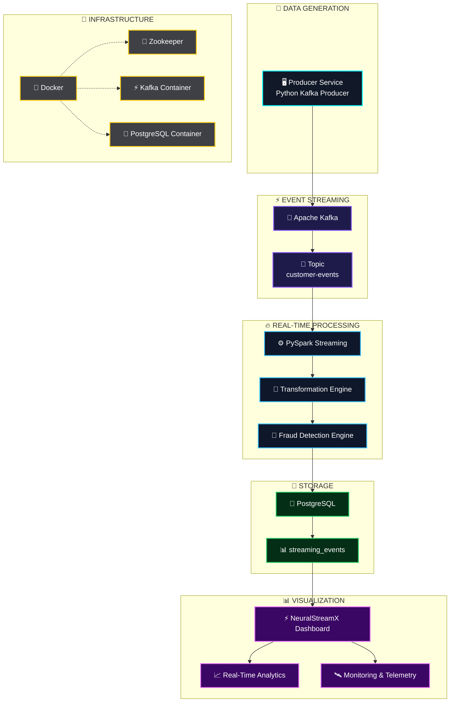
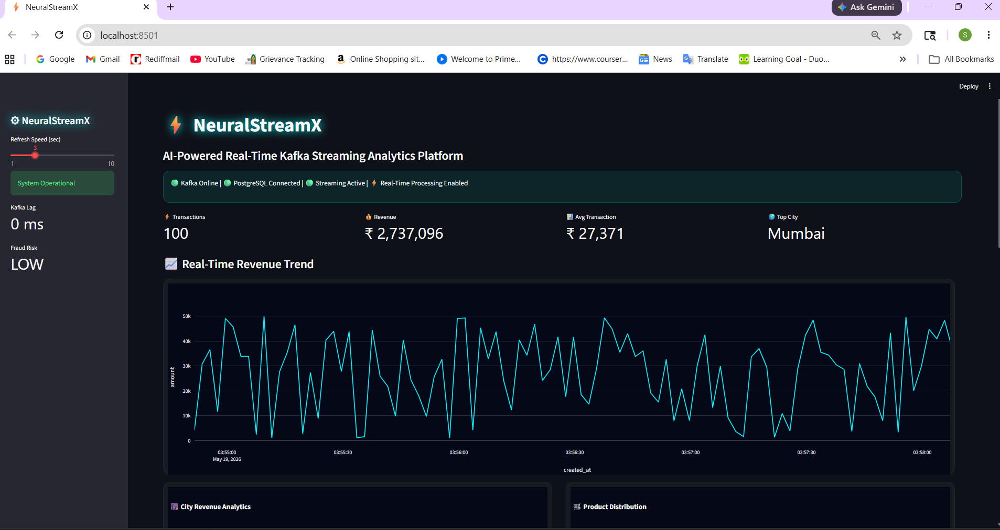

# ⚡ NeuralStreamX

<div align="center">

## AI-Powered Real-Time Kafka Streaming Analytics Platform

A futuristic real-time streaming analytics platform built using Apache Kafka, PySpark Streaming, PostgreSQL, Docker, and Streamlit.

Designed to simulate enterprise-grade streaming pipelines with real-time analytics, fraud detection, monitoring, and cyberpunk-style visualization.

<br>


</div>

---

# 🚀 Features

- ⚡ Real-time Kafka event streaming
- 🔥 PySpark Structured Streaming pipeline
- 🧠 AI-style fraud detection alerts
- 📊 Futuristic live analytics dashboard
- 🌍 Real-time transaction monitoring
- 🐳 Dockerized infrastructure
- 💾 PostgreSQL persistent storage
- 📈 Streaming transformations
- 🛰 Monitoring and logging system
- 🔄 Fault tolerance & checkpointing
- 🎨 Cyberpunk-inspired UI design

---

# 🏗 Enterprise Architecture



---

# 📸 Dashboard Preview

## ⚡ NeuralStreamX Real-Time Dashboard



---

# 📊 Dashboard Features

- 📈 Real-time revenue analytics
- 🌍 City-wise transaction monitoring
- 🛒 Product distribution analysis
- 🚨 AI fraud detection alerts
- ⚡ Live activity feed
- 🛰 System health telemetry
- 🎨 Cyberpunk futuristic UI

---

# ⚙ Tech Stack

| Technology | Purpose |
|---|---|
| Apache Kafka | Real-time event streaming |
| PySpark Streaming | Stream processing |
| PostgreSQL | Data persistence |
| Docker | Containerized infrastructure |
| Streamlit | Dashboard visualization |
| Plotly | Interactive charts |
| Python | Backend & streaming logic |

---

# 📂 Project Structure

```bash
real-time-kafka-streaming-pipeline/
│
├── configs/
├── consumer/
├── dashboard/
├── database/
├── docker/
├── docs/
├── logs/
├── monitoring/
├── producer/
├── screenshots/
├── tests/
│
├── README.md
├── requirements.txt
└── .gitignore
```

---

# 🐳 Docker Infrastructure

Containerized services:

- 📡 Apache Kafka
- ⚡ Zookeeper
- 🐘 PostgreSQL

Start all services:

```bash
docker-compose up -d
```

---

# ▶ Running The Project

## 1️⃣ Start Kafka Producer

```bash
python producer/producer.py
```

---

## 2️⃣ Start Spark Streaming Consumer

```bash
spark-submit \
--packages org.apache.spark:spark-sql-kafka-0-10_2.12:3.5.1,org.postgresql:postgresql:42.7.3 \
consumer/spark_streaming.py
```

---

## 3️⃣ Launch Dashboard

```bash
streamlit run dashboard/app.py
```

---

# 🧠 AI Fraud Detection

Transactions exceeding configured thresholds are automatically flagged as suspicious.

Example:
- High-value transactions
- Abnormal spikes
- Suspicious transaction patterns

---

# 📈 Resume Impact

This project demonstrates:

- Distributed systems knowledge
- Real-time data engineering
- Event-driven architecture
- Streaming analytics
- Production-grade pipeline design
- Dashboard engineering
- Docker infrastructure management

---

# 🔥 Future Enhancements

- 🌍 Real-time global transaction map
- 🤖 AI anomaly detection engine
- 📡 Kafka lag monitoring
- ☸ Kubernetes deployment
- 📊 Grafana integration
- ⚡ Redis caching layer
- ☁ AWS / Azure deployment
- 🧠 Machine learning prediction engine

---

# 👨‍💻 Author

### Sudhanshu Dhande

Built with ⚡ Kafka + PySpark + PostgreSQL + Streamlit

---